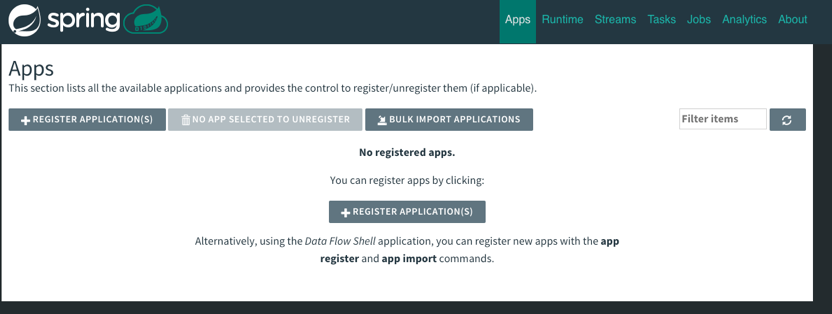
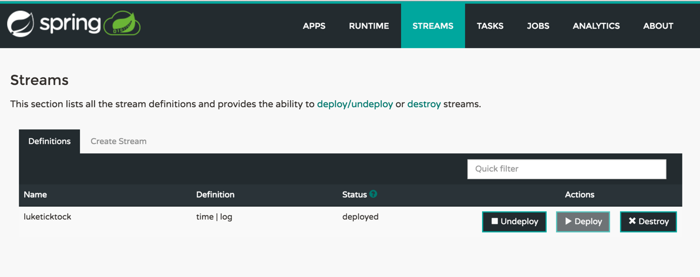
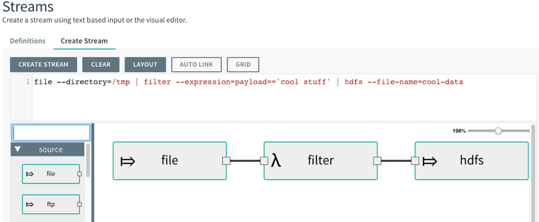

# Spring Cloud Data Flow Demo

This is a simple demo to explore Spring Cloud Data Flow working on Cloud Foundry to provide an experience similar to Spring XD.

## Overview

Spring Cloud Data Flow provides an abstration for the following Spring projects to stream data from sources to sinks (while providing filtering and processing in between).

- Spring Data
- Spring Integration
- Spring Batch

This can be done with minimal knowledge of these projects opening the door for none Java developers to create flows.

An example stream might be:

FTP -> Transform Objects to JSON -> Filter on 'country=CA' -> HDFS

This stream would poll a FTP for files. Each row of a file would be converted to JSON. Only JSON where the attribute 'country' was equal to 'CA' would then be written down to HDFS.

Using Spring Cloud Data Flow each step in this stream would become a application orchestrated by Pivotal Cloud Foundry.

### Setting Up The Server In PCF

The following steps need to be completed to get the server set up to submit Spring Cloud Data Flow streams.

1. Download the Spring Cloud Server project
2. Download the Spring Cloud Shell project
3. Create a Redis Service in PCF
4. Create a Rabbit Service in PCF
5. Push the Server project into PCF
6. Set up environmental variables for the Server to integrate with the elastic runtime of PCF
7. Start the Server

Running demo_setup_1.sh will perform all the steps on PWS (run.pivotal.io). The script needs the organization, space, username and password as arguements. The supplied account details need the permissions to create new applications.

```shell
./demo_setup_1.sh 'My Org' 'luke' 'email@mydomain.com' 'mypassword'
```
Upon successful completetion of the script, the admin application can be managed from the app console


The dashboard will provide information about the Streams running and other useful details about the state of the Spring Cloud Data Flow Server (http://luke-dataflow-server.cfapps.io/dashboard)



### Connecting To The Running Server

Next step is too connect a locally running Spring Cloud Shell to the running server to create the famous TickTock stream. To do this start the Shell application locally and use the `dataflow config server` command to connect to the server.

```shell
➜  spring-cloud-data-flow-demo git:(master) ✗ java -jar spring-cloud-dataflow-shell-1.0.1.RELEASE.jar
  ____                              ____ _                __
 / ___| _ __  _ __(_)_ __   __ _   / ___| | ___  _   _  __| |
 \___ \| '_ \| '__| | '_ \ / _` | | |   | |/ _ \| | | |/ _` |
  ___) | |_) | |  | | | | | (_| | | |___| | (_) | |_| | (_| |
 |____/| .__/|_|  |_|_| |_|\__, |  \____|_|\___/ \__,_|\__,_|
  ____ |_|    _          __|___/                 __________
 |  _ \  __ _| |_ __ _  |  ___| | _____      __  \ \ \ \ \ \
 | | | |/ _` | __/ _` | | |_  | |/ _ \ \ /\ / /   \ \ \ \ \ \
 | |_| | (_| | || (_| | |  _| | | (_) \ V  V /    / / / / / /
 |____/ \__,_|\__\__,_| |_|   |_|\___/ \_/\_/    /_/_/_/_/_/

1.0.1.RELEASE

Welcome to the Spring Cloud Data Flow shell. For assistance hit TAB or type "help".
server-unknown:>dataflow config server http://luke-dataflow-server.cfapps.io/
Successfully targeted http://luke-dataflow-server.cfapps.io/
dataflow:>

```

Next we perform the following steps:

1. Register the sources
2. Register the sinks
3. Register the processors
3. Create a simple test stream

The commands to registers the sources, sinks and processors have been put into a command files that can be executed from the shell once its connected to the server:
- register-processor-apps.cmd
- register-sink-apps.cmd
- register-source-apps.cmd.

Once the shell is connected, a command file can be executed like this.

```shell
dataflow:>script --file register-processor-apps.cmd
app register --name bridge --type processor --uri maven://org.springframework.cloud.stream.module:bridge-processor:jar:exec:1.0.1.RELEASE
Successfully registered module 'processor:bridge'
app register --name filter --type processor --uri maven://org.springframework.cloud.stream.module:filter-processor:jar:exec:1.0.1.RELEASE
Successfully registered module 'processor:filter'
app register --name groovy-filter --type processor --uri maven://org.springframework.cloud.stream.module:groovy-filter-processor:jar:exec:1.0.1.RELEASE
Successfully registered module 'processor:groovy-filter'
app register --name groovy-transform --type processor --uri maven://org.springframework.cloud.stream.module:groovy-transform-processor:jar:exec:1.0.1.RELEASE
Successfully registered module 'processor:groovy-transform'
app register --name httpclient --type processor --uri maven://org.springframework.cloud.stream.module:httpclient-processor:jar:exec:1.0.1.RELEASE
Successfully registered module 'processor:httpclient'
app register --name pmml --type processor --uri maven://org.springframework.cloud.stream.module:pmml-processor:jar:exec:1.0.1.RELEASE
Successfully registered module 'processor:pmml'
...and so on...

```
To see the apps

```shell
dataflow:>app  list
╔══════════════╤════════════════╤═══════════════════╤════╗
║    source    │   processor    │       sink        │task║
╠══════════════╪════════════════╪═══════════════════╪════╣
║file          │bridge          │aggregate-counter  │    ║
║ftp           │filter          │cassandra          │    ║
║http          │groovy-filter   │counter            │    ║
║jdbc          │groovy-transform│field-value-counter│    ║
║jms           │httpclient      │file               │    ║
║load-generator│pmml            │ftp                │    ║
║rabbit        │splitter        │gemfire            │    ║
║sftp          │transform       │gpfdist            │    ║
║tcp           │                │hdfs               │    ║
║time          │                │jdbc               │    ║
║              │                │log                │    ║
╚══════════════╧════════════════╧═══════════════════╧════╝

```

To list the streams (none have been defined yet in this example)

```shell
dataflow:>stream list
╔═══════════╤═════════════════╤══════╗
║Stream Name│Stream Definition│Status║
╚═══════════╧═════════════════╧══════╝

dataflow:>
```
To register the famous TickTock stream as an example, run the following

```shell
dataflow:>stream create luketicktock --definition "time | log" --deploy
Created and deployed new stream 'ticktock'
dataflow:>

```
The stream can now be seen in the UI



In the apps console we can see a Micro Service (Spring Boot) for each task in the stream has been deployed and given a route. They are also bound to the Rabbit and Redis services.


We can now see the result of the stream showing up in the Micro Service for the logging step of the flow


New streams can be created using the admin-ui.



Only the sources and sinks that are registered with the server will show up in the palette. Custom apps can be registered.

# References

http://cloud.spring.io/spring-cloud-dataflow/

https://github.com/spring-projects/spring-integration-java-dsl/wiki/spring-integration-java-dsl-reference
